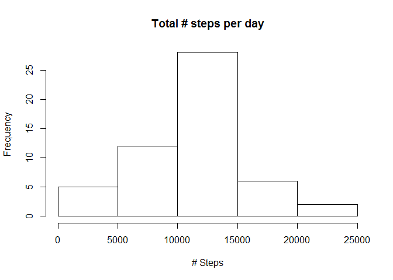
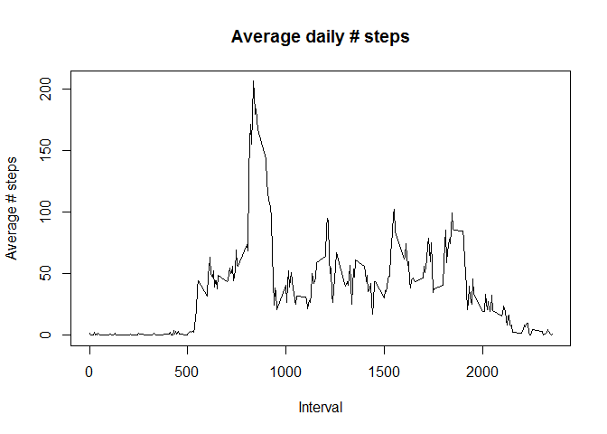
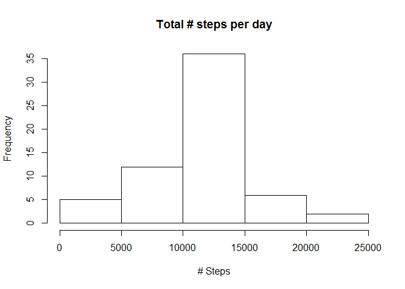
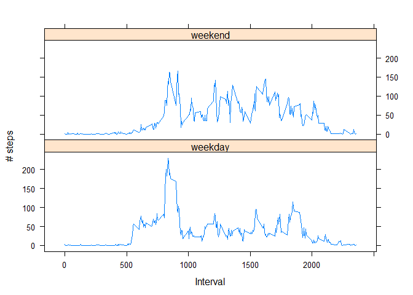

# Reproducible Research: Peer Assessment 1
Göran Ramsfeldt  
Sunday, May 17, 2015  


## Loading and preprocessing the data
Save the original data set and make a work copy.

```r
data.org <- read.csv(unz("activity.zip","activity.csv"))
data <- data.org 
```


## What is mean total number of steps taken per day?
For this part of the assignment, we ignore the missing values in the dataset.

- Calculate the total number of steps taken per day.
- Make a histogram of the total number of steps taken each day.

```r
steps_by_day <- aggregate(steps ~ date, data, sum)
hist(steps_by_day$steps, main="Total # steps per day", xlab="# Steps")  
```

 

- Make a summary to get the mean and median of the total number of steps taken per day.

```r
summary(steps_by_day$steps)
```

```
##    Min. 1st Qu.  Median    Mean 3rd Qu.    Max. 
##      41    8841   10760   10770   13290   21190
```

## What is the average daily activity pattern?
- Make a time series plot of the 5-minute interval (x-axis) and the average number of steps taken, averaged across all days (y-axis)

```r
steps_by_interval <- aggregate(steps ~ interval, data, mean)
plot(steps_by_interval, type="l", main="Average daily # steps", xlab="Interval", 
     ylab="Average # steps")
```

 


- Which 5-minute interval, on average across all the days in the dataset, contains the maximum number of steps?

```r
max <- which.max(steps_by_interval$steps)
steps_by_interval [max, ]
```

```
##     interval    steps
## 104      835 206.1698
```
Interval 835 contain the maximum nr of steps, 206.

## Imputing missing values
Note that there are a number of days/intervals where there are missing values (coded as NA). 
The presence of missing days may introduce bias into some calculations or summaries of the data.

- Calculate and report the total number of missing values in the dataset.

```r
sum(is.na(data$steps))
```

```
## [1] 2304
```
The total number of rows with NAs is 2304. 

**Devise a strategy for filling in all of the missing values in the dataset.**

- Create a new dataset that is equal to the original dataset but with the missing data filled in. We will use the mean for that 5-minute interval.

```r
data.filled <- data.org

for (i in 1:nrow(data.filled)){
  if (is.na(data.filled$steps[i])){
    interval_val <- data.filled$interval[i]
    row_id <- which(steps_by_interval$interval == interval_val)
    steps_val <- steps_by_interval$steps[row_id]
    data.filled$steps[i] <- steps_val
  }
}

data.filled[!complete.cases(data.filled),]
```

```
## [1] steps    date     interval
## <0 rows> (or 0-length row.names)
```


- Make a histogram of the total number of steps taken each day and Calculate and report the mean and median total number of steps taken per day. 

```r
filled_steps_by_day <- aggregate(steps ~ date, data.filled, sum)
hist(filled_steps_by_day$steps, main="Total # steps per day", xlab="# Steps")
```

 


```r
summary(steps_by_day$steps)
```

```
##    Min. 1st Qu.  Median    Mean 3rd Qu.    Max. 
##      41    8841   10760   10770   13290   21190
```

```r
summary(filled_steps_by_day$steps)
```

```
##    Min. 1st Qu.  Median    Mean 3rd Qu.    Max. 
##      41    9819   10770   10770   12810   21190
```

The new values differ from the estimates from the first part of the assignment. But the impact of imputing missing data is very small.

## Are there differences in activity patterns between weekdays and weekends?
We use the dataset with the filled-in missing values for this part.

- Create a new factor variable in the dataset with two levels – “weekday” and “weekend” indicating whether a given date is a weekday or weekend day.

```r
data.filled$date <- as.Date(strptime(data.filled$date, format="%Y-%m-%d"))
data.filled$day <- weekdays(data.filled$date)
for (i in 1:nrow(data.filled)) {                                      
  if (data.filled[i,]$day %in% c("söndag","lördag")) {             
    data.filled[i,]$day<-"weekend"                                
  }
  else{
    data.filled[i,]$day<-"weekday"                          
  }
}
```

- Make a panel plot containing a time series plot (i.e. type = "l") of the 5-minute interval (x-axis) and the average number of steps taken, averaged across all weekday days or weekend days (y-axis). 


```r
#steps_by_weekday <- aggregate(data.filled$steps ~ data.filled$interval + data.filled$day, data.filled, mean)
steps_by_weekday <- aggregate(steps ~ interval + day, data.filled, mean)

library(lattice)
names(steps_by_weekday) <- c("interval", "day", "steps")
xyplot(steps ~ interval | day, steps_by_weekday, type = "l", layout = c(1, 2), xlab = "Interval", ylab = "# steps")
```

 
